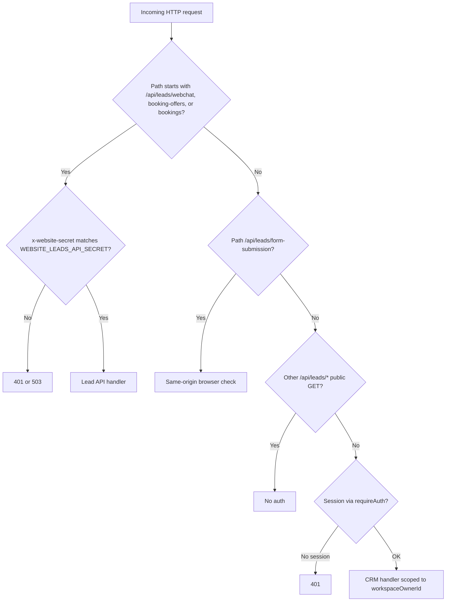
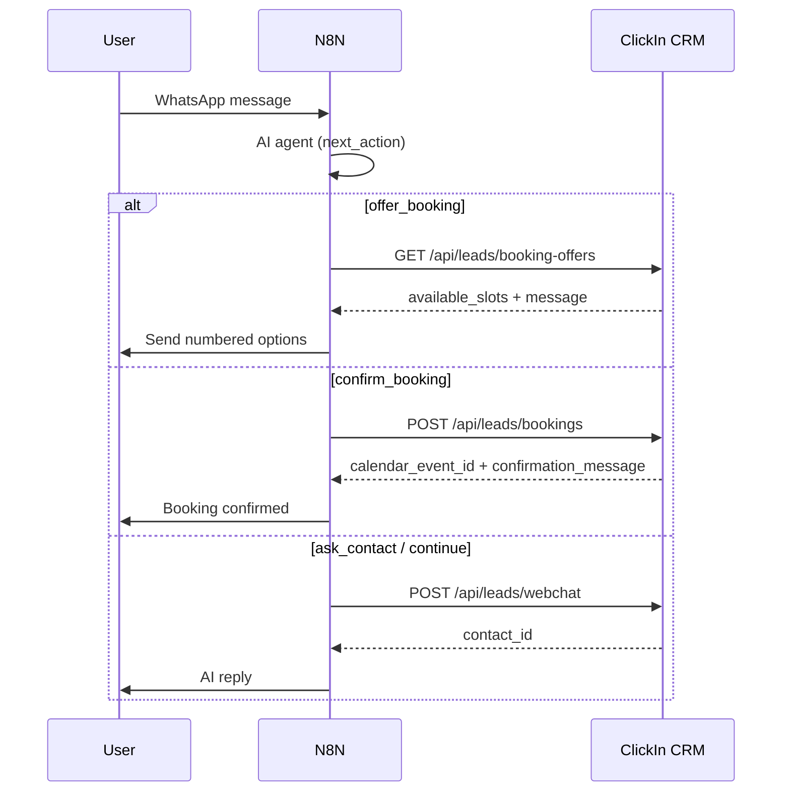

# ClickIn 360 CRM — Complete API Guide

**Product:** ClickIn 360 CRM  
**API prefix:** `{BASE_URL}/api`  
**Default local base URL:** `http://localhost:3000` (from `NEXT_PUBLIC_APP_URL`)

This guide covers authentication, every public integration endpoint, the full CRM REST surface, outbound webhooks, and N8N/WhatsApp booking flows.

---

## Table of contents

1. [Introduction](#1-introduction)
2. [Quick start](#2-quick-start)
3. [Authentication](#3-authentication)
4. [Conventions](#4-conventions)
5. [Errors & status codes](#5-errors--status-codes)
6. [Workspace & roles](#6-workspace--roles)
7. [Lead API (integrations)](#7-lead-api-integrations)
8. [Public endpoints (no secret)](#8-public-endpoints-no-secret)
9. [CRM API (session)](#9-crm-api-session)
10. [Outbound webhooks (CRM → N8N)](#10-outbound-webhooks-crm--n8n)
11. [N8N / WhatsApp booking flow](#11-n8n--whatsapp-booking-flow)
12. [Website integration](#12-website-integration)
13. [Environment variables](#13-environment-variables)
14. [Troubleshooting](#14-troubleshooting)
15. [API index](#15-api-index)

---

## 1. Introduction

ClickIn 360 exposes a **Next.js App Router** HTTP API under `/api`. There are two audiences:

| Audience | Auth | Typical use |
|----------|------|-------------|
| **Automation** (N8N, WhatsApp bots, server scripts) | `x-website-secret` header | Leads, chat insights, calendar offers, bookings |
| **CRM users** (dashboard) | Browser session (NextAuth) | Contacts, opportunities, tickets, calendar, settings |

There is **no** single “CRM API key” for third parties to call all routes. For automation, use the **Lead API** (`/api/leads/*`).

**What the Lead API creates:**

- **Contact** (or updates returning visitor by email/phone) — uses `contacts.company` **text**, not the Accounts (`companies`) table
- **Note** (transcript or AI summary)
- **Opportunity** (first pipeline, stage `Qualified Lead`; always has `contact_id`)
- **Calendar event** (on booking — CRM calendar only; always has `contact_id`; no Google sync on lead path)
- **Activity log** + optional **in-app notification** for assignee
- Optional **outbound** `website.lead` webhook to N8N

**Contact-centric CRM (Phase 5):** Dashboard-created **tickets** and **calendar events** require a linked `contact_id`. The Accounts object was removed from CRM navigation; `/accounts` URLs redirect to contacts. Legacy `PATCH /api/integrations/accounts/[id]` and `/api/companies` remain for automation on existing `companies` rows — **website and Lead API flows do not depend on them.**

---

## 2. Quick start

### 2.1 Configure the server (5 minutes)

1. In Supabase → **Authentication** → **Users**, copy the **workspace owner** UUID.
2. In CRM `.env.local` (or production env):

```bash
NEXT_PUBLIC_APP_URL=http://localhost:3000
WEBSITE_LEADS_USER_ID=<owner-uuid>
WEBSITE_LEADS_API_SECRET=<run: openssl rand -hex 32>
NEXTAUTH_SECRET=<run: openssl rand -base64 32>
NEXTAUTH_URL=http://localhost:3000
```

3. Restart the CRM (`npm run dev` or redeploy).
4. In CRM: **Settings → Booking availability** and **Settings → Website leads** (assignee).

### 2.2 Test the Lead API

```bash
export BASE_URL=http://localhost:3000
export SECRET=your-website-leads-api-secret

# Health (no auth)
curl -s "$BASE_URL/api/health"

# Booking offers (auth required)
curl -s "$BASE_URL/api/leads/booking-offers?lang=es" \
  -H "x-website-secret: $SECRET" | jq

# Create lead from chat
curl -s -X POST "$BASE_URL/api/leads/webchat" \
  -H "Content-Type: application/json" \
  -H "x-website-secret: $SECRET" \
  -d '{
    "contact_info": {
      "name": "Test User",
      "email": "test@example.com",
      "phone": "+15551234567"
    },
    "ai_insights": { "ai_summary": "Test lead from API" }
  }' | jq
```

---

## 3. Authentication

### 3.1 Lead API — `x-website-secret`

| Item | Detail |
|------|--------|
| **Header name** | `x-website-secret` |
| **Value** | Must equal server env `WEBSITE_LEADS_API_SECRET` |
| **Who sets it** | **You** — it is not issued by a portal |
| **Where to set (server)** | `.env.local` or hosting env vars |
| **Where to set (N8N)** | HTTP Request node → Headers |

**Generate a secret:**

```bash
openssl rand -hex 32
```

**Example request:**

```http
POST /api/leads/webchat HTTP/1.1
Host: your-domain.com
Content-Type: application/json
x-website-secret: a1b2c3...your-secret...f9e8
```

**Responses:**

| Status | Cause |
|--------|--------|
| `503` | `WEBSITE_LEADS_API_SECRET` not set on server |
| `401` | Header missing or wrong |

**Protected Lead routes:**

- `POST /api/leads/webchat`
- `GET /api/leads/booking-offers`
- `POST /api/leads/bookings`

**Protected Integration PATCH routes** (same header + `WEBSITE_LEADS_USER_ID` tenant):

- `PATCH /api/integrations/contacts/[id]`
- `PATCH /api/integrations/tickets/[id]`
- `GET` / `POST /api/integrations/opportunities`
- `PATCH /api/integrations/opportunities/[id]`
- `PATCH /api/integrations/accounts/[id]` — company accounts (CRM “accounts”)

**Server-only (never send in requests):**

| Variable | Purpose | Where to get |
|----------|---------|--------------|
| `WEBSITE_LEADS_USER_ID` | Tenant for all leads/bookings | Supabase Auth → Users → owner **UID** |
| `NEXT_PUBLIC_APP_URL` | Base URL for N8N and links | Your deployment URL |

---

### 3.2 CRM dashboard — session (NextAuth)

| Item | Detail |
|------|--------|
| **How** | Log in at `{BASE_URL}/login` |
| **Methods** | Email/password (all roles) or Google Workspace (`@clickin360.com`; viewers blocked) |
| **Mechanism** | HTTP-only session cookie (JWT strategy) |
| **Use** | CRM UI and `/api/*` from the same browser |
| **Not for** | N8N, mobile apps, long-lived integrations |

**Session fields:**

| Field | Meaning |
|-------|---------|
| `session.user.id` | Canonical CRM user id (workspace owner UUID for tenant data) |
| `session.user.authUserId` | Supabase `auth.users` id used to sign in (password/profile auth-admin calls) |

**Required env:**

```bash
NEXTAUTH_SECRET=<openssl rand -base64 32>
NEXTAUTH_URL=<same as NEXT_PUBLIC_APP_URL>
GOOGLE_OAUTH_CLIENT_ID=<Google Cloud OAuth client>
GOOGLE_OAUTH_CLIENT_SECRET=<secret>
WEBSITE_LEADS_USER_ID=<workspace owner Supabase UUID>
# Optional — owner dual-email login (comma-separated)
OWNER_LOGIN_ALIASES=owner@clickin360.com,personal@gmail.com
```

**Google OAuth redirect (login):** `{APP_URL}/api/auth/callback/google` must be in Google Cloud authorized redirect URIs.

**Programmatic CRM access:** Not officially supported without session cookies. Use Lead API for automation.

See [AUTH-ROADMAP.md](./AUTH-ROADMAP.md) for login policy and dual-email owner mapping.

#### Password reset (public)

| Method | Path | Auth |
|--------|------|------|
| `POST` | `/api/auth/forgot-password` | None |

**Body:** `{ "email": "user@example.com" }`

Sends a Supabase reset email. The server sets `redirectTo` to `{NEXT_PUBLIC_APP_URL or NEXTAUTH_URL}/auth/callback?next=/reset-password` — not the browser origin.

**Supabase (required for production):**

- **Site URL:** `https://www.clickin360.com` (or your canonical CRM host)
- **Redirect URLs:** `https://www.clickin360.com/auth/callback` (must match allow list exactly, including `www`)

User flow: `/forgot-password` → email link → `/auth/callback?code=…&next=/reset-password` → `/reset-password`.

---

### 3.3 CRM → N8N (outbound only)

CRM **calls** your N8N instance when events occur (if configured).

| Variable | Purpose |
|----------|---------|
| `N8N_WEBHOOK_URL` | Base URL; CRM POSTs to `{N8N_WEBHOOK_URL}/{event}` |
| `N8N_API_KEY` | Optional; sent as `X-N8N-Auth` |

This does **not** authenticate requests **into** the CRM.

---

### 3.4 Auth decision diagram



---

## 4. Conventions

### 4.1 Base URL

All examples use `{BASE_URL}` = value of `NEXT_PUBLIC_APP_URL`.

Paths: `{BASE_URL}/api/...`

### 4.2 JSON

- Request: `Content-Type: application/json`
- Response: JSON unless noted (e.g. PDF download)
- Timestamps: ISO 8601 UTC unless labeled as local wall time
- UUIDs: standard string format

### 4.3 Pagination (CRM list endpoints)

Many `GET` list routes support:

| Query | Default | Max |
|-------|---------|-----|
| `page` | `1` | — |
| `limit` | `20` | `100` |

Response shape:

```json
{
  "data": [ ],
  "pagination": { "page": 1, "limit": 20, "total": 42 }
}
```

### 4.4 Idempotency

- **Returning visitors:** Same email or phone → contact updated, new note + opportunity (not a duplicate error).
- **Bookings:** Slot validated at request time; concurrent books may get `409 slot_unavailable`.

---

## 5. Errors & status codes

### 5.1 Standard error body

```json
{
  "error": "Human-readable message",
  "code": "optional_machine_code",
  "details": { }
}
```

`details` appears on Zod validation failures (`400`).

### 5.2 Status reference

| Code | Meaning |
|------|---------|
| `200` | OK |
| `201` | Created |
| `400` | Validation failed |
| `401` | Unauthorized (session or secret) |
| `403` | Forbidden (role, same-origin, owner-only) |
| `404` | Not found |
| `409` | Conflict (duplicate, slot taken) |
| `500` | Server error |
| `503` | Lead API not configured |

---

## 6. Workspace & roles

All CRM data is scoped to a **workspace owner** (`workspaceOwnerId`). Team members act inside the owner’s workspace.

| Role | Read | Write | Settings & team |
|------|------|-------|-----------------|
| `owner` | Yes | Yes | Yes |
| `admin` | Yes | Yes | Yes (teammate; cannot delete workspace) |
| `sales` | Yes | Yes | No |
| `viewer` | Yes | No (`403` on writes; UI simulates saves for demos) | No |

**Check current context:**

```http
GET /api/workspace/context
Cookie: <session>
```

**Response:**

```json
{
  "workspaceOwnerId": "uuid",
  "role": "owner",
  "isWorkspaceOwner": true,
  "actorUserId": "uuid"
}
```

---

## 7. Lead API (integrations)

**Auth:** `x-website-secret` on all endpoints in this section.

---

### 7.1 `POST /api/leads/webchat`

Create or update a lead from webchat, WhatsApp qualification, or N8N.

**When to use:** Sync contact + AI insights without booking a call.

**Request body:**

| Field | Type | Required | Notes |
|-------|------|----------|-------|
| `contact_info.name` | string | Yes | Full name → split to first/last |
| `contact_info.email` | string | Yes | Valid email |
| `contact_info.phone` | string | Yes | Min 5 chars |
| `contact_info.company` | string | No | |
| `ai_insights` | object | No | See table below |
| `conversation_transcript` | string | No | If set, becomes note body |
| `ga_client_id` | string | No | Stored in `custom_fields` |
| `visitor_id` | string | No | Fallback for `ga_client_id` |
| `source` | `"webchat"` | No | |

**`ai_insights` fields:**

| Field | Maps to contact |
|-------|-----------------|
| `platform` | `platform`, custom_fields |
| `friction_area` | string or array → `friction_area` |
| `communication_channels` | string or array |
| `signals` | `signals` |
| `ai_summary` | `ai_summary`, opportunity notes |
| `recommended_offer` | Included in note text |
| `qualified` | Activity metadata |
| `confidence_score` | Accepted; not persisted to dedicated column |

**Example:**

```json
{
  "contact_info": {
    "name": "María López",
    "email": "maria@tienda.com",
    "phone": "+525512345678",
    "company": "Tienda Demo"
  },
  "ai_insights": {
    "platform": "Shopify",
    "friction_area": ["returns", "shipping"],
    "communication_channels": ["WhatsApp", "Instagram"],
    "signals": "support_overload",
    "ai_summary": "B2C store wants post-purchase automation.",
    "recommended_offer": "ECOMMERCE + CRM + WHATSAPP + AI",
    "qualified": true,
    "confidence_score": 0.87
  },
  "conversation_transcript": "Usuario: Hola...\nAndrea: ..."
}
```

**Response `201`:**

```json
{
  "contact_id": "550e8400-e29b-41d4-a716-446655440000",
  "opportunity_id": "660e8400-e29b-41d4-a716-446655440001",
  "calendar_event_id": null,
  "assigned_to": "770e8400-e29b-41d4-a716-446655440002",
  "returning_visitor": false
}
```

**Returning visitor:** `returning_visitor: true` — same email/phone; contact patched, new note + opportunity.

---

### 7.2 `GET /api/leads/booking-offers`

Returns **numbered discovery-call options** across multiple days (replaces GoHighLevel `getFreeSlots` + format step).

Respects:

- **Settings → Booking availability** (days, hours, timezone, min notice, horizon, duration, buffer)
- Existing **CRM `calendar_events`** (busy times)

**Query parameters:**

| Param | Default | Description |
|-------|---------|-------------|
| `lang` | `es` | `es` \| `en` — message and labels |
| `reschedule` | `false` | `true` → up to 6 slots, reschedule intro text |
| `limit` | `3` or `6` | Integer `1`–`12` |

**Example:**

```http
GET /api/leads/booking-offers?lang=es&reschedule=false
x-website-secret: YOUR_SECRET
```

**Response `200`:**

```json
{
  "timezone": "America/Mexico_City",
  "timezone_label": "hora Ciudad de México",
  "meeting_duration_minutes": 30,
  "buffer_minutes": 15,
  "available_slots": [
    "2026-05-26T15:00:00.000Z",
    "2026-05-27T18:00:00.000Z",
    "2026-05-28T21:00:00.000Z"
  ],
  "offers": [
    {
      "index": 1,
      "start": "2026-05-26T15:00:00.000Z",
      "date": "2026-05-26",
      "time": "09:00",
      "label": "martes, 26 de mayo, 9:00 a.m."
    }
  ],
  "message": "Aquí tienes opciones reales del calendario:\n\n1) ...\n\nZona horaria: hora Ciudad de México.\n\nResponde con el número de tu opción...",
  "next_action": "book_call",
  "reschedule": false,
  "count": 3
}
```

**N8N:** Save `available_slots` in session; send `message` to the user; when user replies `1`/`2`/`3`, call bookings with `slot_index`.

---

### 7.3 `POST /api/leads/bookings`

Book a discovery call: **contact + opportunity + CRM calendar event**.

**When to use:** User confirmed slot (`confirm_booking` in your bot flow).

**Slot selection (one of):**

| Method | Fields |
|--------|--------|
| By index | `slot_index` (1-based) + `offered_slots` from previous `booking-offers` |
| By ISO | `slot_start` e.g. `2026-05-27T18:00:00.000Z` |

**Request body:**

| Field | Type | Required |
|-------|------|----------|
| `contact_info` | object | Yes |
| `slot_index` | number | If not using `slot_start` |
| `offered_slots` | string[] | Required with `slot_index` |
| `slot_start` | string (ISO) | If not using index |
| `qualification` / `ai_insights` | object | No |
| `conversation_transcript` | string | No |
| `source` | `webchat` \| `whatsapp` \| `form` | No |
| `language` | `es` \| `en` | No — affects confirmation text |

**Example (index):**

```json
{
  "contact_info": {
    "name": "María López",
    "email": "maria@tienda.com",
    "phone": "+525512345678"
  },
  "slot_index": 2,
  "offered_slots": [
    "2026-05-26T15:00:00.000Z",
    "2026-05-27T18:00:00.000Z",
    "2026-05-28T21:00:00.000Z"
  ],
  "ai_insights": {
    "platform": "Shopify",
    "ai_summary": "Qualified for discovery call."
  },
  "source": "whatsapp",
  "language": "es"
}
```

**Response `201`:**

```json
{
  "contact_id": "uuid",
  "opportunity_id": "uuid",
  "calendar_event_id": "uuid",
  "assigned_to": "uuid-or-null",
  "returning_visitor": false,
  "slot_start": "2026-05-27T18:00:00.000Z",
  "slot_label": "miércoles, 27 de mayo, 12:00 p.m.",
  "timezone": "America/Mexico_City",
  "booking_confirmed_at": "2026-05-23T12:00:00.000Z",
  "confirmation_message": "Listo, tu llamada quedó agendada.\n\n📅 ...",
  "next_action": "booked"
}
```

**Errors:**

| Status | `code` | Action |
|--------|--------|--------|
| `409` | `slot_unavailable` | Call `booking-offers` again |
| `400` | `missing_slot` | Provide `slot_start` or index + `offered_slots` |

**Note:** Does **not** sync to Google Calendar. Owner’s Google connection applies only to events created via CRM calendar UI/API.

---

### 7.4 Integration PATCH API (CRM updates)

Partial updates for existing CRM records. Same auth as Lead API (`x-website-secret`). All writes apply to the workspace owner in `WEBSITE_LEADS_USER_ID`.

| Method | Path | Description |
|--------|------|-------------|
| `PATCH` | `/api/integrations/contacts/[id]` | Same body as `PATCH /api/contacts/[id]` (`contactPatchSchema`). Fires `contact.updated` webhook. |
| `PATCH` | `/api/integrations/tickets/[id]` | Same body as `PATCH /api/tickets/[id]` (`ticketPatchSchema`). |
| `GET` | `/api/integrations/opportunities` | List opportunities (`pipeline_id`, `contact_id`, `stage`, `search` query params). |
| `POST` | `/api/integrations/opportunities` | Create opportunity (same body as CRM `POST /api/opportunities`, includes `owner_id`, `tags`). |
| `PATCH` | `/api/integrations/opportunities/[id]` | Same body as `PATCH /api/opportunities/[id]` (full partial or `{ "stage": "..." }` only). Fires `opportunity.updated` webhook. |
| `PATCH` | `/api/integrations/accounts/[id]` | Legacy **companies** table fields (`name`, `website`, …). Prefer `PATCH /api/integrations/contacts/[id]` for website/N8N lead enrichment. |

**Example — update contact from N8N:**

```bash
curl -s -X PATCH "$BASE_URL/api/integrations/contacts/CONTACT_UUID" \
  -H "Content-Type: application/json" \
  -H "x-website-secret: $SECRET" \
  -d '{"status":"active","ai_summary":"Qualified via WhatsApp"}' | jq
```

**Example — move opportunity stage:**

```bash
curl -s -X PATCH "$BASE_URL/api/integrations/opportunities/OPP_UUID" \
  -H "Content-Type: application/json" \
  -H "x-website-secret: $SECRET" \
  -d '{"stage":"Proposal"}' | jq
```

**Example — create opportunity with owner and tags:**

```bash
curl -s -X POST "$BASE_URL/api/integrations/opportunities" \
  -H "Content-Type: application/json" \
  -H "x-website-secret: $SECRET" \
  -d '{
    "pipeline_id": "PIPELINE_UUID",
    "contact_id": "CONTACT_UUID",
    "title": "WhatsApp deal",
    "stage": "Qualified Lead",
    "owner_id": "USER_UUID",
    "tags": "whatsapp,hot"
  }' | jq
```

**Responses:** `200`/`201` with record JSON; `400` validation; `401`/`503` auth; `404` not found; `409` duplicate contact email/phone.

---

### 7.5 Quotes API (session only)

Quotes use the `documents` table (types `estimate`, `proposal`, `contract`). Requires dashboard session auth (not `x-website-secret`).

| Method | Path | Description |
|--------|------|-------------|
| `GET` | `/api/documents` | List quotes/documents (`contact_id`, `company_id`, `opportunity_id` filters). |
| `POST` | `/api/documents` | Create quote (JSON or multipart upload). |
| `GET` | `/api/documents/[id]` | Quote detail including `line_items[]`. |
| `PATCH` | `/api/documents/[id]` | Update title, content, status, `header_html`, `footer_html`, totals. |
| `PUT` | `/api/documents/[id]/line-items` | Replace line items + `tax_rate`; recalculates subtotal/tax/total. |
| `POST` | `/api/documents/[id]/pdf` | Generate PDF (merges variables, header/footer, line-item table). |
| `POST` | `/api/documents/[id]/send-via-gmail` | Send quote as PDF via the signed-in user's Gmail / Workspace mailbox. |
| `GET` | `/api/quote-services` | Service catalog for line items. |
| `POST` | `/api/quote-services` | Add catalog service (`name`, `unit_price`, …). |
| `PATCH` | `/api/quote-services/[id]` | Update catalog service. |
| `DELETE` | `/api/quote-services/[id]` | Remove catalog service (owner/admin). Returns `409` with `quotes[]` when referenced on quote line items. |

**Line items body (`PUT /api/documents/[id]/line-items`):**

```json
{
  "tax_rate": 16,
  "line_items": [
    {
      "description": "CRM implementation",
      "quantity": 1,
      "unit_price": 2500,
      "service_id": "optional-catalog-uuid"
    }
  ]
}
```

**Migration:** run `migrations/025_quotes_services_locale.sql` on Supabase before using quotes or CRM locale.

---

## 8. Public endpoints (no secret)

### 8.1 `GET /api/health`

Database connectivity check.

```json
{
  "status": "ok",
  "database": "connected",
  "timestamp": "2026-05-23T12:00:00.000Z"
}
```

---

### 8.2 `GET /api/leads/booking-availability`

Booking rules for website / debugging.

**Query:** `lang=es|en`

**Response (excerpt):**

```json
{
  "timezone": "America/Mexico_City",
  "days": [1, 2, 3, 4, 5],
  "start_time": "09:00",
  "end_time": "17:00",
  "min_notice_hours": 24,
  "max_days_ahead": 21,
  "meeting_duration_minutes": 30,
  "buffer_minutes": 15,
  "hint": "30 min por llamada · Lun–Vie · ...",
  "min_date": "2026-05-24",
  "max_date": "2026-06-13"
}
```

Configured in CRM **Settings → Booking availability**.

---

### 8.3 `GET /api/leads/booking-slots`

Slots for **one calendar day** (website book-call step 3).

**Query:**

| Param | Required |
|-------|----------|
| `date` | Yes — `YYYY-MM-DD` |
| `lang` | No — `es` (default) or `en` |

**Example:**

```http
GET /api/leads/booking-slots?date=2026-05-26&lang=es
```

**Response:**

```json
{
  "date": "2026-05-26",
  "slots": [
    { "time": "09:00", "label": "9:00 a.m." },
    { "time": "09:45", "label": "9:45 a.m." }
  ],
  "meeting_duration_minutes": 30,
  "timezone": "America/Mexico_City",
  "unavailable_reason": null,
  "message": null
}
```

Excludes times blocked by CRM calendar events.

---

### 8.4 `POST /api/leads/form-submission`

Website **book-call** form (same-origin only).

**Auth:** Browser must send `Origin` matching host (not `x-website-secret`).

**Body:**

```json
{
  "contact_info": {
    "name": "María López",
    "email": "maria@example.com",
    "phone": "+525512345678",
    "company": "Tienda"
  },
  "qualification": {
    "platform": "Shopify",
    "friction_area": ["abandoned carts"]
  },
  "calendar_selection": {
    "date": "2026-05-26",
    "time": "09:00",
    "timezone": "America/Mexico_City"
  },
  "language": "es",
  "ga_client_id": "optional"
}
```

**Response `201`:** Same shape as webchat + `calendar_event_id` when `calendar_selection` provided.

---

### 8.5 `GET /api/team/invites/validate`

Validate invite token (registration page).

```http
GET /api/team/invites/validate?token=<invite-token>
```

```json
{ "valid": true, "email": "user@example.com", "display_name": "Jane" }
```

---

## 9. CRM API (session)

All routes require login (`401` without session). Data filtered by `workspaceOwnerId`.

**Roles:** `owner` | `admin` | `sales` can write CRM data; `admin` also manages settings/team. `viewer` is read-only (`403` on writes). **Owner-only:** `DELETE /api/account` (delete workspace).

---

### 9.1 Account & workspace

#### `GET /api/workspace/context`

Current user’s workspace and role. See [§6](#6-workspace--roles).

#### `GET /api/account`

Account summary for logged-in user.

#### `GET /api/account/profile`

Profile fields including `email_signature_html`.

#### `PATCH /api/account/profile`

Update display name, email, and HTML email signature.

```json
{
  "full_name": "Jane Doe",
  "email": "jane@clickin360.com",
  "email_signature_html": "<p>Best,<br>Jane</p>"
}
```

Auth email updates use `session.user.authUserId` (not canonical id when aliased).

#### `POST /api/account/password`

Change password (authenticated). Verifies current password against session email; updates `authUserId` Supabase account.

```json
{
  "current_password": "old",
  "new_password": "newpassword8"
}
```

---

### 9.2 Team (owner / admin)

#### `GET /api/team/members`

List workspace members.

#### `POST /api/team/members`

Invite teammate (email, role: `sales` | `admin` | `viewer`).

#### `PATCH /api/team/members/{memberUserId}`

Update an existing teammate's role (`sales` | `admin` | `viewer`). Owner role cannot be changed.

```json
{ "role": "admin" }
```

#### `DELETE /api/team/members/{memberUserId}`

Remove a teammate from the workspace (**owner only**). Also clears pending invites for that email.

#### `POST /api/team/invites/complete`

Complete registration with invite token + password.

---

### 9.3 Contacts

#### `GET /api/contacts`

| Query | Description |
|-------|-------------|
| `page`, `limit` | Pagination |
| `search` | Matches name, email, company |
| `status` | `lead` \| `active` \| `inactive` \| `prospect` |
| `created_from`, `created_to` | Date filters (`YYYY-MM-DD`) |

#### `POST /api/contacts`

**Body (required fields):** `first_name`, `last_name`, `status`; **email or phone** required.

```json
{
  "first_name": "María",
  "last_name": "López",
  "email": "maria@example.com",
  "phone": "+525512345678",
  "company": "Tienda Demo",
  "status": "lead",
  "platform": "Shopify",
  "ai_summary": "Notes from sales",
  "tags": "vip,shopify",
  "custom_fields": { "lead_source": "referral" }
}
```

Triggers outbound `contact.created` if N8N configured.

#### `GET /api/contacts/[id]`

Single contact.

#### `PATCH /api/contacts/[id]`

Partial update (`contactPatchSchema`). Triggers `contact.updated`.

#### `DELETE /api/contacts/[id]`

Triggers `contact.deleted`.

#### `GET|POST /api/contacts/[id]/notes`

**POST body:** `{ "content": "...", "activity_type": "note|call|email|meeting" }`

#### `PATCH|DELETE /api/contacts/[id]/notes/[noteId]`

**PATCH body:** `{ "content"?, "activity_type"? }` — at least one field required. Author or workspace admin only.

**DELETE:** Author or workspace admin only.

#### `GET|POST /api/contacts/[id]/tasks`

**POST body:** `{ "title", "description?", "status?", "priority?", "due_date?", "assigned_to?" }`

#### `PATCH|DELETE /api/contacts/[id]/tasks/[taskId]`

#### `GET /api/contacts/[id]/activity-feed`

Timeline of activities (notes, logged calls/meetings, email metadata).

#### Email (Gmail / Google Workspace — per user)

Each CRM user connects their own mailbox (`google_gmail_tokens.user_id` = actor). Sends and sync use that user's OAuth token. Outbound rows are stored under the workspace owner with `mailbox_user_id` set to the sender so replies sync correctly.

| Method | Path |
|--------|------|
| `GET` | `/api/contacts/[id]/emails` |
| `POST` | `/api/contacts/[id]/emails/sync` |
| `POST` | `/api/contacts/[id]/emails/send` |

**Send body** (`gmailSendSchema`):

```json
{
  "to": "customer@example.com",
  "subject": "Follow up",
  "body": "<p>HTML message from rich text composer.</p>",
  "cc": "colleague@example.com",
  "bcc": "archive@example.com",
  "template_id": "optional-uuid",
  "skip_signature_append": false,
  "reply_to_gmail_message_id": "optional-gmail-message-id-for-threading",
  "attachments": [
    { "filename": "brief.pdf", "mime_type": "application/pdf", "content_base64": "..." }
  ]
}
```

Either `template_id` **or** both `subject` and `body` are required. `body` is HTML from the TipTap composer (merge fields resolved on send). `cc` / `bcc` optional (comma-separated or single). `skip_signature_append: true` omits the user's My Account signature block. `attachments` optional base64 array. `reply_to_gmail_message_id` sets In-Reply-To / References for Gmail threading.

**Send responses:**

| Status | Body |
|--------|------|
| `200` | `{ "success": true, "message_id", "thread_id" }` |
| `403` | `{ "error", "needs_gmail_connect": true }` — Gmail not connected |
| `404` | Contact or template not found |

After send, the API saves to `contact_emails`, logs activity, fires `email.sent` webhook, and triggers a background sync.

**Sync body:** none (POST with empty body).

**Sync responses:**

| Status | Body |
|--------|------|
| `200` | `{ "synced", "listed", "contact_email", "hint"? }` |
| `403` | `{ "error", "synced", "needs_reauth"?: true }` — no read scope or not connected |
| `400` | Contact has no email |

Sync searches Gmail for threads involving the contact's email across connected mailboxes (actor + thread mailbox owners).

#### Google review request

`POST /api/contacts/[id]/request-review`

Requires workspace write role. Uses workspace review template unless overridden.

```json
{
  "ticket_id": "optional-uuid",
  "subject": "optional override",
  "body": "optional override",
  "cc": "optional comma-separated"
}
```

**Response:** `{ "success": true }` or `{ "error", "code" }` (e.g. opt-out, missing Gmail, missing review URL).

#### Send quote via Gmail

`POST /api/documents/[id]/send-via-gmail`

```json
{
  "to": "customer@example.com",
  "subject": "Quote: Acme estimate",
  "body": "<p>Optional HTML message. PDF attached automatically.</p>",
  "cc": "optional",
  "bcc": "optional",
  "template_id": "optional-uuid",
  "skip_signature_append": false,
  "attachments": []
}
```

Same `gmailSendSchema` as contact send. Requires Gmail connected for the signed-in user. Updates document `status` to `sent`, stores PDF, logs on linked contact when `contact_id` is set.

---

### 9.4 Opportunities

#### `GET /api/opportunities`

List with filters (pipeline, stage, contact).

#### `POST /api/opportunities`

```json
{
  "contact_id": "uuid",
  "title": "Discovery Call — Acme",
  "stage": "Qualified Lead",
  "pipeline_id": "uuid",
  "value": 5000,
  "currency": "USD",
  "probability": 50,
  "notes": "From WhatsApp"
}
```

Triggers `opportunity.created`.

#### `GET|PATCH|DELETE /api/opportunities/[id]`

PATCH triggers `opportunity.updated`; DELETE triggers `opportunity.deleted`.

---

### 9.5 Tickets

#### `GET|POST /api/tickets`

**POST:** Requires **`contact_id`** (UUID); `subject` min 3 chars. Legacy `company_id` is derived from the contact when not sent.

```json
{
  "contact_id": "uuid",
  "subject": "Refund request",
  "description": "Customer wants return",
  "status": "open",
  "priority": "medium"
}
```

#### `GET|PATCH|DELETE /api/tickets/[id]`

#### `GET|POST /api/tickets/[id]/notes`

#### Ticket email (Gmail; requires linked contact with email)

| Method | Path | Notes |
|--------|------|--------|
| `GET` | `/api/tickets/[id]/emails` | Thread for ticket contact (`ticket_id` set on send, or unscoped contact mail) |
| `POST` | `/api/tickets/[id]/emails/sync` | Same as contact sync for the linked contact |
| `POST` | `/api/tickets/[id]/emails/send` | Same body as contact send (`gmailSendSchema`); tags `ticket_id` on save |

---

### 9.6 Companies (legacy API)

Accounts were removed from CRM navigation. These routes remain for legacy data and integration PATCH; new website leads use **contacts** only.

| Method | Path |
|--------|------|
| `GET`, `POST` | `/api/companies` |
| `GET`, `PATCH`, `DELETE` | `/api/companies/[id]` |
| `GET` | `/api/companies/[id]/related` |

Legacy UI URLs `/accounts` and `/accounts/[id]` redirect to `/contacts` and `/contacts?company_id=…`.

---

### 9.7 Pipelines

| Method | Path |
|--------|------|
| `GET`, `POST` | `/api/pipelines` |
| `GET`, `PATCH`, `DELETE` | `/api/pipelines/[id]` |

**POST body:** `{ "name", "stages": [{ "id", "name", "order" }] }`

**PATCH** `/api/pipelines/[id]` — update name and/or stage list (including reorder via `order` values).

`POST /api/pipelines/seed` — idempotent default pipeline for workspace (owner/admin).

---

### 9.8 Calendar

Use **`/api/calendar/events`** (the removed `GET /api/calendar` overview route is not available).

#### `GET /api/calendar/events`

| Query | Description |
|-------|-------------|
| `contact_id` | Filter |
| `company_id` | Filter |
| `opportunity_id` | Filter |
| `start_date`, `end_date` | Range (`YYYY-MM-DD`) |

#### `POST /api/calendar/events`

```json
{
  "contact_id": "uuid",
  "title": "Discovery call",
  "description": "Notes",
  "start_time": "2026-05-26T15:00:00.000Z",
  "end_time": "2026-05-26T15:30:00.000Z",
  "location": "123 Main St",
  "location_type": "physical",
  "assigned_to": "uuid-or-null"
}
```

**`location_type`:** `physical` | `google_meet` | `other`. When `google_meet` and Calendar is connected, a Meet link is generated on sync.

Requires **`contact_id`**. May sync to **Google Calendar** if user connected integration. DB constraint `calendar_events_contact_required_check` (migration 037). `assigned_to` column (migration 050).

#### `GET|PATCH|DELETE /api/calendar/events/[id]`

---

### 9.9 Settings

#### `GET /api/settings`

Returns `default_currency`, `default_sales_assignee`, `booking_availability`, quote branding fields (`quote_primary_color`, `quote_font_family`), `updated_at`.

#### `PATCH /api/settings` (owner/admin)

```json
{
  "default_currency": "USD",
  "default_sales_assignee": "uuid-or-null",
  "quote_primary_color": "#1e3a5f",
  "quote_font_family": "Inter",
  "booking_availability": {
    "timezone": "America/Mexico_City",
    "days": [1, 2, 3, 4, 5],
    "start_time": "09:00",
    "end_time": "17:00",
    "min_notice_hours": 24,
    "max_days_ahead": 21,
    "meeting_duration_minutes": 30,
    "buffer_minutes": 15
  }
}
```

#### `PATCH /api/settings/member`

Member-accessible workspace settings (sales+). Booking availability, Google review URL, review template id.

##### `GET /api/settings/integrations`

Admin integration status (owner/admin): N8N, WhatsApp, Stripe, Mailgun, GA4 Data API (`GA4_PROPERTY_ID` + service account), Google OAuth configured flags; masked property id when set.

---

### 9.10 Integrations

Google OAuth uses `GOOGLE_CLIENT_ID` / `GOOGLE_CLIENT_SECRET` (or legacy `GOOGLE_OAUTH_CLIENT_ID` / `GOOGLE_OAUTH_CLIENT_SECRET`). Redirect URIs default to `{NEXT_PUBLIC_APP_URL}/api/auth/google-gmail/callback` and `…/google-calendar/callback` unless overridden by env.

| Method | Path | Description |
|--------|------|-------------|
| `GET` | `/api/integrations/google-calendar/status` | Calendar connected for signed-in user |
| `POST` | `/api/integrations/google-calendar/disconnect` | Disconnect signed-in user's Calendar |
| `GET` | `/api/auth/google-calendar` | Start Calendar OAuth |
| `GET` | `/api/integrations/google-workspace/setup` | OAuth checklist + per-user Gmail/Calendar status |
| `GET` | `/api/integrations/gmail/status` | Gmail status (signed-in user) |
| `DELETE` | `/api/integrations/gmail/disconnect` | Disconnect signed-in user's Gmail |
| `GET` | `/api/auth/google-gmail` | Start Gmail OAuth |
| `GET` | `/api/auth/google-gmail/reconnect` | Re-consent (send + read scopes) |
| `POST` | `/api/integrations/n8n/inbound` | Inbound N8N callbacks (`x-n8n-secret`) |
| `POST` | `/api/public/support/validate-cid` | Public — validate CID; returns short-lived session token (rate limited) |
| `POST` | `/api/public/support/tickets` | Public — submit support ticket (requires session token from validate step) |
| `GET`, `PATCH` | `/api/settings/support-widget` | Admin/owner — enable `/support`, embed code, default assignee, email notifications |
| `POST` | `/api/webhooks/stripe` | Stripe webhooks (`STRIPE_WEBHOOK_SECRET`): `checkout.session.completed`, `payment_intent.succeeded`, `invoice.paid` — records `payments` row, quote payment notes |
| `POST` | `/api/quotes/public/[token]/checkout` | Public — create Stripe Checkout session for accepted quote (no session auth) |

Calendar events sync to the **logged-in user's** connected Google Calendar on create/update (`google_sync_user_id` stores the sync account for legacy rows). If the actor has not connected Calendar, the form shows a non-blocking warning.

---

### 9.11 Other CRM resources

| Area | Endpoints |
|------|-----------|
| **Payments** | `GET /api/payments` |
| **Search** | `GET /api/search?q=...` |
| **Analytics** | `GET /api/analytics/pipeline`, `/api/analytics/operations`, `GET /api/analytics/ga4?days=7\|30\|90` (authenticated; GA4 env required) |
| **Duplicates** | `GET|POST /api/duplicate-reviews`, `PATCH /api/duplicate-reviews/[id]` (`action`: `dismiss` \| `merge`) |
| **Custom fields** | `GET|POST /api/custom-fields`, `GET|PATCH|DELETE /api/custom-fields/[id]` |
| **Tags** | `GET|POST /api/contact-tags`, `GET|PATCH|DELETE /api/contact-tags/[id]` |
| **Notifications** | `GET|POST /api/notifications`, `PATCH /api/notifications/[id]` |
| **Notification prefs** | `GET|PATCH /api/notification-preferences` — includes `email_notifications` (inbound email), `task_reminders`, `opportunity_reminders`, `ticket_notifications`, `email_frequency`, `timezone` |
| **Saved filters** | `GET|POST /api/saved-filters`, `GET|PATCH|DELETE /api/saved-filters/[id]` |
| **Quotes (documents)** | `/api/documents`, line-items, pdf, send-via-gmail, `/api/quote-services` |
| **Templates** | `/api/document-templates`, `/api/email-templates` (list excludes `automation` and `review_request` categories; use `GET /api/email-templates/[id]` for any template by id) |

Validators: `lib/validators/index.ts`  
Types: `types/index.ts`

#### Email templates

| Method | Path | Notes |
|--------|------|--------|
| `GET` | `/api/email-templates` | List workspace templates; **excludes** `category` `automation` and `review_request` |
| `POST` | `/api/email-templates` | Create (`name`, `subject`, `body`, optional `category`) |
| `GET` | `/api/email-templates/[id]` | Single template (any category, including review) |
| `PATCH` | `/api/email-templates/[id]` | Update |
| `DELETE` | `/api/email-templates/[id]` | Delete |

Review invitation copy is managed via Settings (review URL + review template), not the general template picker list.

---

## 10. Outbound webhooks (CRM → N8N)

When `N8N_WEBHOOK_URL` is set, CRM POSTs:

```http
POST {N8N_WEBHOOK_URL}/{event}
Content-Type: application/json
X-N8N-Auth: {N8N_API_KEY}
```

**Event names:**

| Event | When |
|-------|------|
| `website.lead` | Lead API created/updated visitor |
| `contact.created` | Contact created in CRM |
| `contact.updated` | Contact updated |
| `contact.deleted` | Contact deleted |
| `opportunity.created` | Opportunity created |
| `opportunity.updated` | Opportunity updated |
| `opportunity.deleted` | Opportunity deleted |
| `email.sent` | Email sent via Gmail integration |
| `document.sent` | Document sent |

**Example `website.lead` payload:**

```json
{
  "contact_id": "uuid",
  "opportunity_id": "uuid",
  "calendar_event_id": "uuid-or-null",
  "source": "webchat",
  "assigned_to": "uuid-or-null",
  "returning_visitor": false
}
```

Configure N8N webhook path to match: e.g. `https://n8n.example.com/webhook/website.lead` if base is `https://n8n.example.com/webhook`.

---

## 11. N8N / WhatsApp booking flow

Replaces GoHighLevel nodes with CRM Lead API.

### 11.1 Flow map

| AI `next_action` | CRM endpoint |
|------------------|--------------|
| `offer_booking` | `GET /api/leads/booking-offers` |
| `reschedule` | `GET /api/leads/booking-offers?reschedule=true&limit=6` |
| `confirm_booking` | `POST /api/leads/bookings` |
| `continue`, `ask_contact`, `human_review` | `POST /api/leads/webchat` (optional sync) |

### 11.2 Session fields (Supabase `lead_sessions`)

| Field | Source |
|-------|--------|
| `available_slots` | `booking-offers` → `available_slots` |
| `selected_slot_index` | User message `1`/`2`/`3` |
| `selected_slot` | `offered_slots[index-1]` or bookings response `slot_start` |

### 11.3 N8N HTTP Request — offers

- **Method:** GET  
- **URL:** `{{ $env.CRM_BASE_URL }}/api/leads/booking-offers?lang=es`  
- **Header:** `x-website-secret: {{ $env.WEBSITE_LEADS_API_SECRET }}`  
- **Store:** `available_slots`, send `message` to user

### 11.4 N8N HTTP Request — book

- **Method:** POST  
- **URL:** `{{ $env.CRM_BASE_URL }}/api/leads/bookings`  
- **Body:**

```json
{
  "contact_info": {
    "name": "{{ $json.name }}",
    "email": "{{ $json.email }}",
    "phone": "{{ $json.phone_number }}"
  },
  "slot_index": {{ $json.selected_slot_index }},
  "offered_slots": {{ $json.available_slots }},
  "ai_insights": {
    "platform": "{{ $json.platform }}",
    "ai_summary": "{{ $json.summary }}"
  },
  "conversation_transcript": "{{ $json.conversation_history }}",
  "source": "whatsapp",
  "language": "es"
}
```

- **Send to user:** `confirmation_message` from response

### 11.5 Sequence diagram



---

## 12. Website integration

| Feature | Mechanism |
|---------|-----------|
| Marketing site | `/es`, `/en`, book-call page |
| Slot picker | `GET /api/leads/booking-slots?date=` |
| Form submit | `POST /api/leads/form-submission` (same-origin) |
| Chat widget | `NEXT_PUBLIC_N8N_WEBCHAT_EMBED_URL` or script URL |
| Chat → CRM | N8N calls `POST /api/leads/webchat` |

---

## 13. Environment variables

| Variable | Required | Description |
|----------|----------|-------------|
| `NEXT_PUBLIC_APP_URL` | Yes | Public CRM URL |
| `WEBSITE_LEADS_API_SECRET` | Lead API | Shared secret; **you generate** |
| `WEBSITE_LEADS_USER_ID` | Lead API + owner tenant | Supabase owner UUID |
| `OWNER_LOGIN_ALIASES` | Optional | Comma-separated emails mapped to `WEBSITE_LEADS_USER_ID` at login |
| `NEXTAUTH_SECRET` | CRM login | Session signing |
| `NEXTAUTH_URL` | CRM login | Usually = app URL |
| `N8N_WEBHOOK_URL` | Optional | Outbound webhook base |
| `N8N_WEBHOOK_SECRET` | Optional | Inbound N8N callback auth (`x-n8n-secret`) |
| `N8N_API_KEY` | Optional | Outbound auth header |
| `N8N_BASE_URL` | Optional | Workflow API (advanced) |
| `WHATSAPP_ACCESS_TOKEN` | Optional | WhatsApp Cloud API |
| `WHATSAPP_PHONE_NUMBER_ID` | Optional | WhatsApp sender |
| `WHATSAPP_VERIFY_TOKEN` | Optional | Meta webhook verification |
| `STRIPE_SECRET_KEY` | Optional | Stripe Checkout for public quote Pay Now |
| `STRIPE_WEBHOOK_SECRET` | Optional | Stripe webhook signature verification |
| `GA4_PROPERTY_ID` | Optional | GA4 property resource name, e.g. `properties/123456789` |
| `GOOGLE_ANALYTICS_CLIENT_EMAIL` | Optional | Service account email with Analytics Data API |
| `GOOGLE_ANALYTICS_PRIVATE_KEY` | Optional | Service account PEM (`\n` in `.env.local`) |
| `NEXT_PUBLIC_N8N_WEBCHAT_EMBED_URL` | Optional | Chat iframe |
| `NEXT_PUBLIC_N8N_WEBCHAT_SCRIPT_URL` | Optional | Chat script |
| Supabase keys | Yes | `NEXT_PUBLIC_SUPABASE_URL`, service role, etc. |
| `MAILGUN_API_KEY` | Transactional email | Mailgun sending key (team invites, automations) |
| `MAILGUN_DOMAIN` | Transactional email | Verified domain, e.g. `mail.clickin360.com` |
| `MAILGUN_FROM` | Transactional email | e.g. `ClickIn 360 <no-reply@mail.clickin360.com>` |
| `MAILGUN_API_BASE` | Optional | `https://api.mailgun.net` (US) or `https://api.eu.mailgun.net` (EU) |
| `SMTP_*` | Optional fallback | Legacy nodemailer if Mailgun is not set |
| `GOOGLE_CLIENT_ID` | Google OAuth | Or `GOOGLE_OAUTH_CLIENT_ID` |
| `GOOGLE_CLIENT_SECRET` | Google OAuth | Or `GOOGLE_OAUTH_CLIENT_SECRET` |
| `GOOGLE_GMAIL_REDIRECT_URI` | Optional | Override Gmail OAuth callback URL |
| `GOOGLE_CALENDAR_REDIRECT_URI` | Optional | Override Calendar OAuth callback URL |

---

## 14. Troubleshooting

| Problem | Check |
|---------|--------|
| `503` on Lead API | Set `WEBSITE_LEADS_API_SECRET` and restart |
| `401` on Lead API | Header name exact: `x-website-secret`; no typos |
| Leads not in CRM | `WEBSITE_LEADS_USER_ID` = correct owner UUID |
| No slots in offers | Settings → booking days/hours; min notice; calendar not full |
| `409` on book | Slot taken; refresh offers |
| Form `403` | Must call from same origin as site |
| CRM `401` | Log in again; check `NEXTAUTH_*` |
| Google Calendar empty on lead book | Expected — lead path uses CRM calendar only |
| N8N not receiving events | Set `N8N_WEBHOOK_URL`; path must match event name |
| Gmail send `403` | Connect Gmail in Settings → Integrations; check `needs_gmail_connect` in response |
| Replies not syncing | Sender must connect Gmail with read scope (`/api/auth/google-gmail/reconnect`); migration 046 applied |
| Integrations "Setup required" | Set `GOOGLE_CLIENT_ID` + `GOOGLE_CLIENT_SECRET` (or `GOOGLE_OAUTH_*`); restart app |
| OAuth redirect mismatch | Authorized redirect URIs in Google Cloud must match `{APP_URL}/api/auth/callback/google` (login), `…/google-gmail/callback`, and `…/google-calendar/callback` |
| Google login blocked | Use `@clickin360.com` account; viewers must use email/password |
| Owner sees wrong profile | Set `OWNER_LOGIN_ALIASES` and/or `team_members` row for workspace email; `WEBSITE_LEADS_USER_ID` must be canonical owner UUID |
| Password change updates wrong account | Fixed: uses `session.user.authUserId`; redeploy latest `main` |
| Reset link “invalid or already used” right away | Reset was likely sent from the **server** (PKCE) and opened on another device. Redeploy latest code, request a **new** link from `/forgot-password`, and open it on the same device if using Supabase’s default email. With **Mailgun** configured, the API sends a `token_hash` link that works on any device. Ensure Supabase Redirect URLs include `https://www.clickin360.com/auth/callback` |
| Supabase “Database error deleting user” | Run migration **049** (`migrations/049_auth_user_delete_fks.sql`), or in SQL Editor null references then delete: `UPDATE audit_logs SET user_id = NULL WHERE user_id = '<uuid>';` (also `contacts.assigned_to`, `tasks.assigned_to`, `tickets.assigned_to`, `user_settings.default_sales_assignee`). CRM **Remove teammate** clears these automatically. |

---

## 15. API index

### Lead & public

| Method | Path | Auth |
|--------|------|------|
| GET | `/api/health` | None |
| GET | `/api/leads/booking-availability` | None |
| GET | `/api/leads/booking-slots` | None |
| POST | `/api/leads/form-submission` | Same-origin |
| GET | `/api/team/invites/validate` | None |
| POST | `/api/leads/webchat` | `x-website-secret` |
| GET | `/api/leads/booking-offers` | `x-website-secret` |
| POST | `/api/leads/bookings` | `x-website-secret` |
| PATCH | `/api/integrations/contacts/[id]` | `x-website-secret` |
| PATCH | `/api/integrations/tickets/[id]` | `x-website-secret` |
| PATCH | `/api/integrations/opportunities/[id]` | `x-website-secret` |
| PATCH | `/api/integrations/accounts/[id]` | `x-website-secret` |
| GET | `/api/integrations/opportunities` | `x-website-secret` |
| POST | `/api/integrations/opportunities` | `x-website-secret` |
| PATCH | `/api/integrations/opportunities/[id]` | `x-website-secret` |

### CRM (session) — 60+ routes

See [§9](#9-crm-api-session). Full route list matches files under `app/api/**/route.ts`.

### Source code reference

| Topic | File |
|-------|------|
| Lead auth | `lib/website/lead-api-auth.ts` |
| Integration auth | `lib/api/integration-auth.ts` |
| Integration PATCH | `lib/integrations/patch-*.ts` |
| Session auth | `lib/api/auth.ts` |
| Leads | `lib/leads/website-leads.ts` |
| Booking | `lib/leads/book-appointment.ts` |
| Offers | `lib/website/booking-offers.ts` |
| Availability | `lib/website/booking-availability.ts` |
| N8N outbound | `lib/n8n.ts` |
| Validators | `lib/validators/index.ts` |
| Contact company sync | `lib/contacts/enrich-company-from-contact.ts` |
| Migrations | `migrations/035_*` … `050_*` |
| Gmail sync | `lib/google/gmail-sync.ts`, `lib/emails/save-contact-email.ts` |
| Google OAuth | `lib/google/oauth-config.ts` |
| Auth / login policy | `lib/auth.ts`, `lib/auth/login-policy.ts`, `lib/auth/canonical-user.ts` |
| Email signature | `lib/email/signature.ts` |
| N8N / Stripe | `lib/integrations/n8n/`, `lib/integrations/stripe/` |
| Public support (CID) | `lib/support/`, `app/api/public/support/` |

---

*Last updated: 2026-06-12 (Sprint 3 — migration 052). Update this file when adding or changing API routes.*
