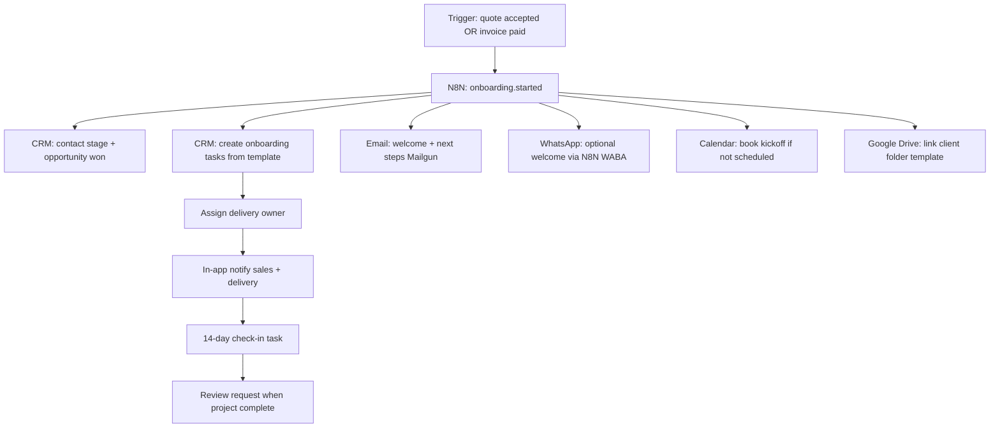

# Customer Onboarding Workflow — Automation Proposal

**Status:** Proposal (not implemented)  
**Audience:** ClickIn 360 operations, sales, and delivery  
**Constraint:** Reuse existing CRM, N8N, WhatsApp, email, quotes, calendar, and contact capabilities — no new auth model.

---

## Executive summary

Customer onboarding today mixes manual handoffs (email threads, ad-hoc checklists, separate tools). The CRM already captures leads, quotes, invoices, tickets, conversations, and calendar bookings. This proposal maps a **phased automation path** from “quote accepted” (or “new paying customer”) through delivery kickoff, using N8N as the orchestrator and the CRM as the system of record.

---

## Current manual steps (baseline)

| Phase | Today (typical) | Pain |
|-------|-----------------|------|
| **Lead → qualified** | Website form / webchat → assignee notified → manual follow-up | Delay before first human touch; context scattered |
| **Discovery** | Calendar booking via CRM offers; notes in contact activity | Good — partially automated |
| **Proposal** | Quote built in CRM, sent via Gmail, customer accepts on public link | Accept event not always wired to delivery |
| **Contract / payment** | Stripe payment link or quote checkout → invoice in Finances | Finance team learns via email/inbox, not structured workflow |
| **Kickoff** | Manual email with onboarding doc, WhatsApp intro, folder setup | Repeated copy-paste; no single “onboarding” record |
| **Delivery** | Tasks, tickets, email threads per contact | No standard milestone template |
| **Support handoff** | Support widget / tickets; separate from sales context | Customer repeats story |

---

## Target automated flow (end state)

---

## Trigger points

| Trigger | CRM source | Recommended automation |
|---------|------------|------------------------|
| **New website lead** | `POST /api/leads/form-submission`, `POST /api/leads/webchat` | Already creates contact + opportunity; extend N8N `website.lead` with qualification branch |
| **Discovery booked** | `POST /api/leads/bookings` | Confirmation email exists; add “pre-call brief” task for assignee |
| **Quote sent** | Gmail send + `email.sent` N8N webhook | Reminder task if no response in N days |
| **Quote accepted** | `POST /api/quotes/public/[token]` → `quote.accepted` | **Primary onboarding trigger** — start workflow |
| **Invoice paid (payment link)** | Stripe webhook → finances | Alternative trigger for services billed without formal quote |
| **First support ticket** | Support widget / `POST /api/tickets` | Handoff notification to delivery + support group |

**Recommendation:** Use **quote accepted** as the default onboarding trigger; use **invoice paid via payment link** when quotes are skipped (retainers, rush engagements).

---

## N8N / automation steps

### Workflow A — Onboarding kickoff (MVP)

1. **Webhook in:** `quote.accepted` or custom `onboarding.start` (CRM already fires `quote.accepted` / `quote.rejected`).
2. **Fetch context:** `GET` contact, document, company via CRM API (or payload from webhook).
3. **Branch on service type:** Read quote line items / custom fields (platform, package tier).
4. **CRM writes:**
   - Update contact lifecycle stage (custom field or tag).
   - Mark opportunity **won**.
   - `POST /api/contacts/[id]/tasks` — create checklist from template (access credentials, brand assets, ad account linking).
   - Log contact activity: “Onboarding started — automated”.
5. **Communications:**
   - Mailgun: welcome email with kickoff link (booking offers URL or static Calendly).
   - Optional: WhatsApp template message via existing N8N WABA flow.
6. **Notify internal:** Sales group email + in-app (`sales_notifications`) already wired for quote accept; add N8N Slack/email digest if needed.

### Workflow B — Asset collection (phase 2)

1. **Delay node** — 24h after kickoff email.
2. If onboarding tasks incomplete → send reminder email.
3. **Google Drive:** Create subfolder under client shared drive (CRM Drive API upload/folder routes) and email link.
4. **Webchat follow-up** — for contacts with WhatsApp session, send checklist reminder.

### Workflow C — Delivery complete → advocacy (phase 3)

1. **Trigger:** All onboarding tasks marked done OR manual “project delivered” tag.
2. Send **review request** using CRM review invitation settings (`review_request_template_id`).
3. Create nurture opportunity for upsell (maintenance, ads management).

---

## CRM data model touchpoints

| Entity | Onboarding use |
|--------|----------------|
| **contacts** | Primary customer record; stages, tags, `customer_id` for support portal |
| **companies** | B2B parent; quote branding |
| **opportunities** | Pipeline stage `won` on accept; amount from quote |
| **documents** (quotes) | `accept_token`, `accepted_at`, `response_name/email` |
| **invoices / payment_links** | Payment confirmation trigger; link to quote via `quote_id` |
| **tasks** | Onboarding checklist items per contact |
| **tickets** | Post-delivery support; link to same contact |
| **contact_activities** | Audit trail for automated steps |
| **calendar_events** | Discovery + kickoff meetings |
| **conversations** | WhatsApp/webchat context for handoff |
| **documents** (attachments) | Drive-linked assets (`source = google_drive`) |
| **notifications** | In-app alerts to sales/support group members |
| **user_settings** | `sales_group_email`, `support_group_email`, assignees |

No new tables required for MVP — use **tasks + tags + activities**. Optional phase-2: `onboarding_runs` table (status, template_id, started_at) if multiple parallel onboardings per contact.

---

## Phased rollout

### Phase 1 — MVP (1–2 weeks)

- [ ] N8N workflow on `quote.accepted` only
- [ ] Task template: 5–7 standard onboarding tasks (JSON in N8N or CRM email template metadata)
- [ ] Welcome email via Mailgun (bilingual EN/ES from contact locale)
- [ ] Opportunity → won + activity log
- [ ] Manual override: “Restart onboarding” button (future CRM UI)

**Success metric:** Time from quote accept to first scheduled kickoff &lt; 48h without manual copy-paste.

### Phase 2 — Payment + assets (2–4 weeks)

- [ ] Add `checkout.session.completed` / payment-link branch in N8N (Stripe metadata already includes `invoice_id`, `workspace_user_id`)
- [ ] Drive folder creation + link in welcome email
- [ ] Reminder sequence for incomplete tasks (day 3, day 7)
- [ ] WhatsApp welcome for contacts with phone on file

### Phase 3 — Full automation (4–8 weeks)

- [ ] Service-type branching (SEO vs ads vs web) with different task sets
- [ ] Support handoff when first ticket opens (notify delivery owner)
- [ ] Review request + upsell opportunity on completion
- [ ] Dashboard: onboarding pipeline (tasks % complete per contact)

---

## What stays manual (by design)

- **Complex scoping calls** — AI/webchat qualifies; human closes scope on discovery call.
- **Custom legal / MSA** — standard quote disclaimer covers most deals; enterprise MSAs stay manual.
- **Ad account technical access** — checklist task, but credentials handled securely outside email.

---

## Dependencies & configuration

| Dependency | Notes |
|------------|-------|
| **N8N** | Webhooks: `quote.accepted`, `website.lead`, `email.sent`; CRM API auth |
| **Mailgun** | Transactional welcome/reminder (already used for leads, support) |
| **Stripe** | Payment-link paid events for alternate trigger |
| **Google Drive** | Workspace connected; client folder template in shared drive |
| **WhatsApp (N8N)** | Optional; uses conversation sync APIs |
| **Migration 070** | Sales/support group emails + in-app prefs for internal alerts |

---

## Risks & mitigations

| Risk | Mitigation |
|------|------------|
| Duplicate onboarding if quote re-opened | Idempotency key: `contact_id + document_id` in N8N |
| Customer gets too many emails | Single welcome + max 2 reminders; respect unsubscribe on marketing only |
| Wrong language | Use contact `locale` / `support_session.language` / quote `locale` |
| Team not watching group inbox | In-app `sales_notifications` / `support_notifications` per user |

---

## Next actions

1. **Operations:** Approve standard onboarding task list (EN + ES).
2. **Sales:** Confirm trigger = quote accept vs payment link per product line.
3. **Engineering:** Implement N8N Workflow A against staging CRM; test with sandbox quote accept.
4. **Review:** After 10 live onboardings, measure kickoff scheduling rate and adjust reminders.

---

*This document is strategic/operational only. Implementation tickets should reference specific API routes and N8N workflow exports in `docs/n8n/`.*
